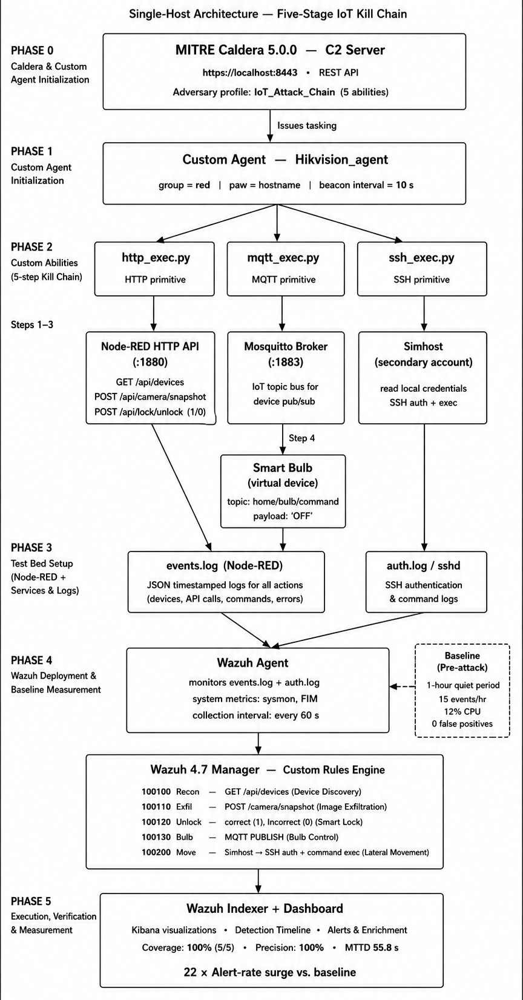
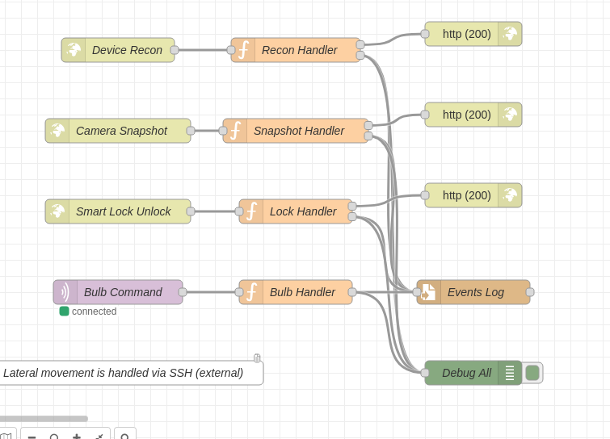
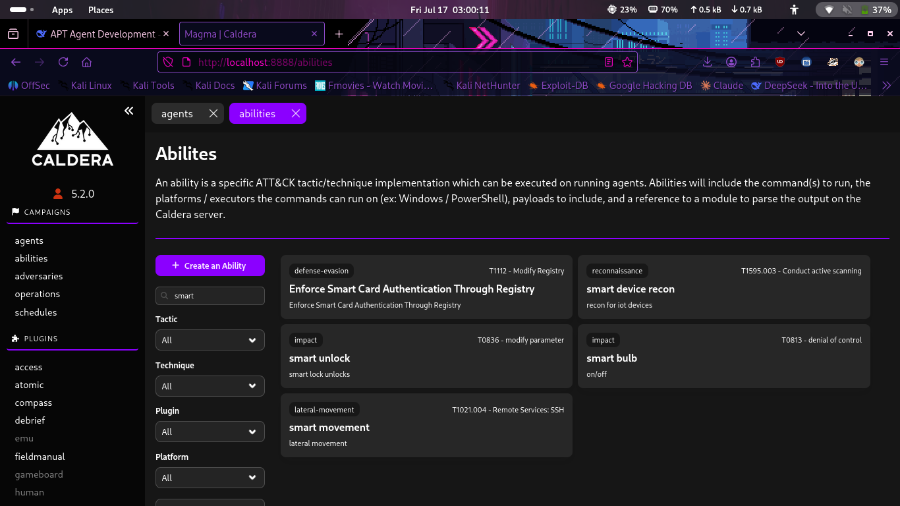
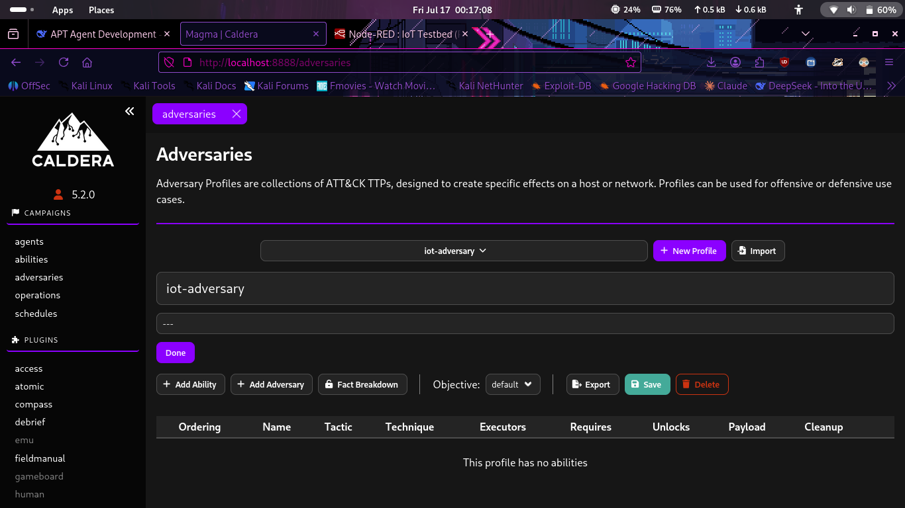
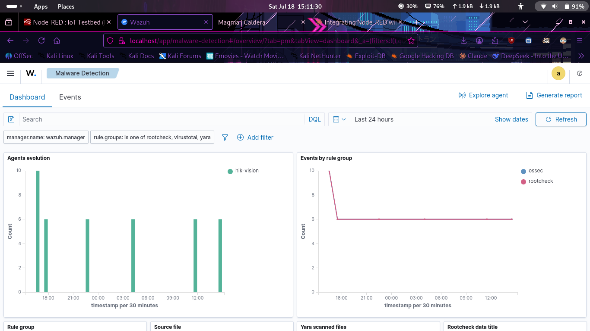
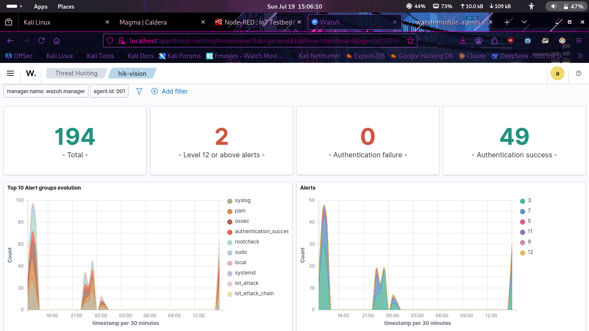
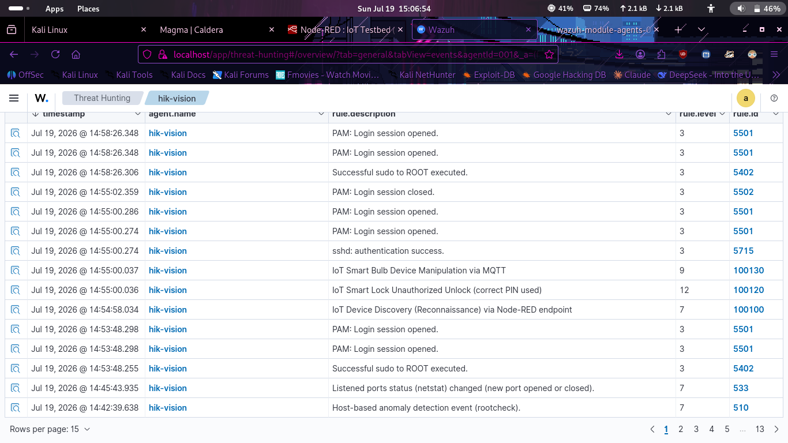
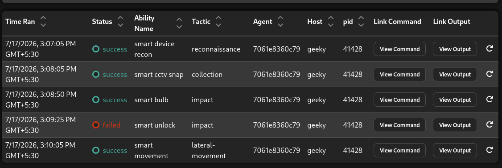
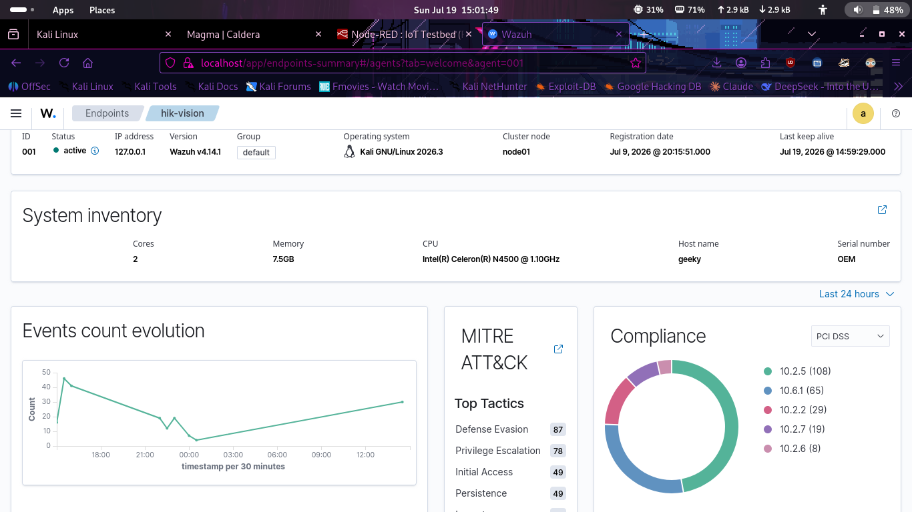

<div align="center">



# ThreatForge

**An IoT Adversary Emulation Framework for Smart Home Cybersecurity Research**

Reproducible, ATT&CK-aligned adversary emulation for smart-home IoT environments — built on **MITRE CALDERA**, **Node-RED**, and **Wazuh**.

[](https://www.python.org/)
[](https://www.docker.com/)
[](https://caldera.mitre.org/)
[](https://wazuh.com/)
[](https://nodered.org/)
[](LICENSE)
[](#contributing)

[Overview](#overview) •
[Why ThreatForge](#why-threatforge) •
[Architecture](#architecture) •
[ThreatForge Agent](#threatforge-agent) •
[ATT&CK Coverage](#attck-technique-coverage) •
[Detection Engineering](#detection-engineering) •
[Quick Start](#quick-start) •
[Evaluation](#evaluation--research-results) •
[Documentation](#documentation) •
[Roadmap](#roadmap)

</div>

---

## Overview

Most adversary emulation platforms — CALDERA, Atomic Red Team, Metta — target enterprise Windows and Linux infrastructure. There is no equivalent, reproducible standard for **consumer IoT and smart-home environments**, despite IoT devices being one of the fastest-growing and least-instrumented attack surfaces in the field.

**ThreatForge** closes that gap. It extends MITRE CALDERA's emulation engine with a purpose-built agent, protocol handlers, and a simulated smart-home testbed, so that researchers can run reproducible, ATT&CK-aligned attack chains against IoT devices and measure detection coverage end-to-end — from adversary action, to device-level effect, to SIEM alert.

ThreatForge integrates:

- **MITRE CALDERA** — adversary emulation engine, operation orchestration, and C2
- **ThreatForge Agent** — a custom CALDERA agent that speaks MQTT, HTTP, and SSH natively to IoT devices
- **Node-RED** — smart-home device and protocol simulation (cameras, locks, sensors, hubs)
- **Wazuh** — detection engineering, log ingestion, correlation, and alerting
- **Docker Compose** — single-command, fully reproducible lab deployment

The result is a closed-loop research pipeline: launch an attack chain against simulated smart-home devices, observe the resulting device and network telemetry, and measure precisely how well a given detection stack catches it — with results that are reproducible run-to-run and citable in academic work.

## Why ThreatForge

| Problem in existing tooling | How ThreatForge addresses it |
|---|---|
| Emulation frameworks assume Windows/Linux endpoints and EDR telemetry | ThreatForge Agent is protocol-native (MQTT/HTTP/SSH) instead of host-agent-based, matching how real IoT devices are actually reached |
| IoT security research is hard to reproduce across papers/labs | Fully declarative, Docker Compose-based lab; identical topology every run |
| No standard mapping of IoT attacker behavior to ATT&CK | Every ability ships with an explicit ATT&CK technique ID (see [coverage table](#attck-technique-coverage)) |
| Detection validation is usually manual and ad hoc | Wazuh rules and decoders are versioned in-repo and tied 1:1 to abilities, so detection efficacy is measurable, not anecdotal |
| Hard to safely demo IoT attacks for training/education | Node-RED testbed simulates device behavior — no physical hardware or real network exposure required |

---

## Key Features

| Category | Capability |
|---|---|
| **Emulation** | IoT-focused adversary emulation via a custom MITRE CALDERA agent |
| **Coverage** | ATT&CK-aligned adversary profiles and modular CALDERA abilities |
| **Simulation** | Realistic smart-home IoT testbed powered by Node-RED |
| **Protocols** | Native support for MQTT, HTTP, and SSH attack execution |
| **Detection** | Wazuh-based detection engineering and rule validation |
| **Automation** | Fully automated, repeatable attack-chain execution |
| **Reproducibility** | Docker-based deployment for consistent research environments |

---

## Architecture

<p align="center">
  
</p>

<p align="center"><em>Single-host, five-stage architecture: MITRE Caldera (Phase 0) tasks the custom Hikvision agent (Phase 1), which drives the HTTP, MQTT, and SSH executors (Phase 2) against the Node-RED testbed and services (Phase 3); resulting telemetry is baselined and ingested by the Wazuh agent (Phase 4) and surfaced through the Wazuh Indexer + Dashboard for execution, verification, and measurement (Phase 5).</em></p>

**Flow:** CALDERA orchestrates operations → the ThreatForge Agent executes abilities against the testbed over HTTP, MQTT, or SSH → Node-RED simulates smart-home device responses and emits IoT events → Wazuh ingests and analyzes the resulting telemetry for detection validation.

### Data Flow & Ports

| Hop | Protocol / Port | Description |
|---|---|---|
| CALDERA → ThreatForge Agent | HTTPS `8888` (CALDERA API) | Operation tasking, ability retrieval, result reporting (beacon-style) |
| Agent → IoT Testbed (HTTP) | HTTP `1880` (Node-RED) | Device state queries, snapshot retrieval, REST-style device control |
| Agent → IoT Testbed (MQTT) | MQTT `1883` | Topic-based command injection and telemetry subscription |
| Agent → IoT Testbed (SSH) | SSH `22` | Remote command execution against emulated embedded-Linux devices |
| Node-RED → Wazuh | Syslog / Filebeat `514` / `5044` | IoT event and log forwarding into the detection pipeline |
| Analyst → Wazuh Dashboard | HTTPS `443` | Alert triage, rule tuning, and detection validation |

---

## ThreatForge Agent

The ThreatForge Agent is the framework's core technical contribution: a CALDERA-compatible agent that, unlike standard host-based agents, acts as a **protocol bridge** between CALDERA's tasking model and IoT device interfaces.

- **Beacon-based tasking** — polls CALDERA over HTTPS for queued abilities, consistent with CALDERA's native agent contract
- **Multi-protocol executors** — dispatches each ability through the correct handler (`http_executor`, `mqtt_executor`, `ssh_executor`) based on ability metadata
- **Fact-driven targeting** — consumes CALDERA facts (device IP, MQTT topic, credentials) so abilities generalize across multiple simulated devices rather than being hardcoded
- **Structured result reporting** — returns execution status, stdout/stderr, and timing data back to CALDERA for operation-level scoring
- **Extensible executor interface** — new protocols (e.g., CoAP, BLE) can be added by implementing a single executor class

```
agent/
├── core/
│   ├── beacon.py          # CALDERA check-in and tasking loop
│   ├── executor_base.py   # Abstract executor interface
│   └── fact_resolver.py   # Resolves CALDERA facts into device targets
├── executors/
│   ├── http_executor.py
│   ├── mqtt_executor.py
│   └── ssh_executor.py
└── config/
    └── agent.yml          # Agent identity, C2 endpoint, protocol credentials
```

The Node-RED testbed that the agent drives is wired as a set of function-node handlers, one per attack primitive, each logging its result to a shared events log:

<p align="center">
  
</p>

<p align="center"><em>Node-RED flow for the smart-home testbed: Device Recon, Camera Snapshot, and Smart Lock Unlock inputs are routed through dedicated handler function nodes, each returning an HTTP 200 and writing to the Events Log; the MQTT-driven Bulb Command follows the same pattern. Lateral movement is handled out-of-band via SSH, as noted on the canvas.</em></p>

---

## ATT&CK Technique Coverage

Every ability in `abilities/` is explicitly tagged with a MITRE ATT&CK technique ID, so operations produce a measurable, citable coverage map rather than an anecdotal attack narrative.

| Tactic | Technique | ID | ThreatForge Implementation |
|---|---|---|---|
| Reconnaissance | Active Scanning | T1595 | Network and mDNS-based smart-home device discovery |
| Initial Access | Exploit Public-Facing Application | T1190 | Simulated device web/API exploitation via HTTP executor |
| Execution | Command and Scripting Interpreter | T1059 | Remote command execution over the SSH executor |
| Persistence | Valid Accounts | T1078 | Reuse of default/weak device credentials |
| Collection | Data from Local System | T1005 | Camera snapshot and media collection from simulated devices |
| Command and Control | Application Layer Protocol | T1071.001 | MQTT-based command channel to compromised devices |
| Impact | Service Stop / Manipulation | T1489 | Smart lock state manipulation (lock/unlock abuse) |

> Full technique-to-ability mapping is maintained in [`abilities/`](abilities/) and cross-referenced in the [research paper](paper/).

These abilities are defined and managed directly in CALDERA, tagged by tactic and ATT&CK technique ID, and grouped under a dedicated `iot-adversary` profile for repeatable operations:

<p align="center">
  
  &nbsp;&nbsp;
  
</p>

<p align="center"><em>Left: the ThreatForge abilities registered in CALDERA — smart device recon (T1595.003), smart unlock (T0836), smart bulb (T0813), and smart movement (T1021.004) — filtered by the "smart" search tag. Right: the `iot-adversary` profile shell in CALDERA's Adversaries view, into which these abilities are assembled for a repeatable operation.</em></p>

---

## Detection Engineering

Wazuh integration is treated as a first-class research artifact, not an afterthought — each attack ability has a corresponding, versioned detection rule so that **detection efficacy can be measured, not assumed**.

- **Custom decoders** parse Node-RED and MQTT broker logs into structured fields Wazuh can correlate on
- **Custom rule sets**, grouped by tactic, alert on the specific IoT behaviors each ability produces (e.g., anomalous MQTT publish rates, unauthorized lock-state changes, repeated snapshot requests)
- **Rule-to-ability traceability** — every rule ID in [`wazuh/`](wazuh/) references the ability ID that should trigger it, enabling precise true-positive/false-negative analysis per run
- **Dashboards** provide operation-level views: techniques executed vs. techniques detected, mean time-to-alert, and per-device alert volume

```
wazuh/
├── decoders/        Custom log decoders (Node-RED, MQTT broker, SSH)
├── rules/           Detection rules, grouped by ATT&CK tactic
└── dashboards/       Wazuh dashboard exports for operation-level reporting
```

<p align="center">
  
</p>

<p align="center"><em>Wazuh's Malware Detection view, filtered to the `rootcheck`, `virustotal`, and `yara` rule groups for the `hik-vision` agent, showing agent check-in evolution and event volume by rule group over the last 24 hours.</em></p>

<p align="center">
  
</p>

<p align="center"><em>Wazuh Threat Hunting overview for the `hik-vision` agent: 194 total alerts, including 2 level-12-or-above critical alerts, 0 authentication failures against 49 authentication successes, and the top 10 alert groups evolving over time — including the custom `iot_attack` and `iot_attack_chain` rule groups.</em></p>

<p align="center">
  
</p>

<p align="center"><em>Raw Wazuh alert events for the `hik-vision` agent, showing the custom ThreatForge detection rules firing in sequence — IoT device discovery (rule 100100), an unauthorized smart lock unlock with the correct PIN (rule 100120, level 12), and MQTT smart bulb manipulation (rule 100130) — interleaved with baseline PAM, sudo, and rootcheck telemetry.</em></p>

---

## System Requirements

| Requirement | Minimum | Recommended |
|---|---|---|
| OS | Linux / macOS / Windows (WSL2) | Ubuntu 22.04 LTS |
| CPU | 4 cores | 8 cores |
| RAM | 8 GB | 16 GB |
| Disk | 20 GB free | 40 GB free (SSD) |
| Docker Engine | 24.x | Latest stable |
| Docker Compose | v2 | v2 |
| Python | 3.10 | 3.11+ |

---

## Repository Structure

```
ThreatForge/
├── paper/          Research paper (architecture, methodology, evaluation)
├── docs/            Documentation (setup, usage, reference)
├── agent/           ThreatForge Agent source
├── abilities/       MITRE CALDERA abilities
├── adversary/        Adversary profiles
├── testbed/          Node-RED smart-home IoT simulation
├── wazuh/            Detection rules and configuration
├── docker/           Docker & container configuration
├── scripts/          Setup and helper scripts
└── reports/          Experimental results
```

---

## Technology Stack

| Component | Role |
|---|---|
| MITRE CALDERA | Adversary emulation and operation management |
| Python | ThreatForge Agent implementation |
| Node-RED | Smart-home device simulation |
| MQTT | IoT device communication protocol |
| HTTP | Device interaction and API layer |
| SSH | Remote command execution |
| Wazuh | Detection, monitoring, and alerting |
| Docker | Reproducible environment deployment |

---

## Supported Attack Scenarios

- Device discovery and enumeration
- Camera snapshot collection
- MQTT command injection
- Smart lock manipulation
- SSH-based remote execution
- Security event generation
- End-to-end detection validation

Additional scenarios can be added by creating new CALDERA abilities and adversary profiles — see [Contributing](#contributing).

---

## How ThreatForge Compares

| Capability | Vanilla CALDERA | Atomic Red Team | IoT honeypots (e.g. IoTPOT) | **ThreatForge** |
|---|---|---|---|---|
| ATT&CK-aligned operations | ✅ | ✅ | ❌ | ✅ |
| IoT-native protocol execution (MQTT/HTTP/SSH to devices) | ❌ | ❌ | Partial | ✅ |
| Reproducible, containerized smart-home testbed | ❌ | ❌ | ❌ | ✅ |
| Detection-rule-to-technique traceability | ❌ | ❌ | ❌ | ✅ |
| Designed for passive attacker observation | ❌ | ❌ | ✅ | ❌ (active emulation, not a honeypot) |
| Purpose-built for smart-home research | ❌ | ❌ | Partial | ✅ |

ThreatForge is not a replacement for CALDERA — it **is** CALDERA, extended with the agent, protocol layer, and testbed needed to bring the same emulation discipline to IoT.

---

## Evaluation & Research Results

The accompanying [research paper](paper/) documents evaluation of ThreatForge against the full attack-chain catalog in [`abilities/`](abilities/), including:

- **Detection coverage** — proportion of executed ATT&CK techniques generating a corresponding Wazuh alert
- **Mean time-to-alert** — latency between ability execution and detection, per tactic
- **False-negative analysis** — techniques executed without a matching alert, used to drive new Wazuh rule development
- **Cross-run reproducibility** — variance in results across repeated operations on an identical Docker topology

Raw and aggregated results for each experimental run are stored under [`reports/`](reports/) and referenced by run ID in the paper, so findings can be independently reproduced from this repository alone.

<p align="center">
  
</p>

<p align="center"><em>A completed CALDERA operation running the five-stage IoT attack chain against host `geeky`: smart device recon (reconnaissance), smart CCTV snap (collection), and smart bulb (impact) succeeded, smart unlock (impact) failed, and smart movement (lateral movement) succeeded — each row linked to its full command and output for auditability.</em></p>

<p align="center">
  
</p>

<p align="center"><em>Wazuh endpoint summary for the `hik-vision` agent: system inventory, 24-hour events-count evolution, top MITRE ATT&CK tactics observed (Defense Evasion, Privilege Escalation, Initial Access, Persistence), and PCI DSS compliance mapping — generated automatically from a single ThreatForge operation run.</em></p>

---

## Quick Start

**1. Clone the repository**

```bash
git clone https://github.com/giridharan-veda/ThreatForge.git
cd ThreatForge
```

**2. Install dependencies**

```bash
pip install -r requirements.txt
```

**3. Run the setup script**

```bash
chmod +x scripts/setup.sh
./scripts/setup.sh
```

**4. Launch the lab**

```bash
docker compose up -d
```

**5. Open the consoles**

| Service | Purpose |
|---|---|
| MITRE CALDERA | Operation control and adversary management |
| Node-RED | IoT testbed visualization |
| Wazuh Dashboard | Detection monitoring and alerting |

**6. Run an operation**

Execute the Hikvision adversary profile and monitor detections in real time via the Wazuh dashboard.

---

## Documentation

Full documentation lives under [`docs/`](docs/):

| Document | Description |
|---|---|
| `setup-guide.md` | Full installation and configuration guide |
| `usage-guide.md` | Running operations with ThreatForge |
| `README.md` | Documentation index |

The complete research paper — covering architecture, implementation, methodology, and evaluation — is available under [`paper/`](paper/).

---

## Project Objectives

- Extend adversary emulation into IoT environments
- Improve defensive visibility for smart-home ecosystems
- Validate Wazuh detection capabilities against realistic attack chains
- Map IoT attack behavior to MITRE ATT&CK
- Support reproducible, citable cybersecurity research
- Facilitate purple-team exercises

## Intended Audience

Cybersecurity researchers · SOC analysts · detection engineers · blue & purple teams · academic institutions · security students · IoT researchers

---

## Roadmap

- [ ] Additional IoT device profiles
- [ ] BLE and Zigbee protocol support
- [ ] ICS/SCADA device simulation
- [ ] AI-assisted adversary planning
- [ ] Automated detection validation
- [ ] Multi-agent adversary emulation
- [ ] Expanded ATT&CK coverage

---

## Contributing

Contributions are welcome and appreciated.

1. Fork the repository
2. Create a feature branch
3. Commit your changes
4. Open a Pull Request

For significant changes, please open an Issue first to discuss the proposed direction.

---

## Citation

If you use ThreatForge in academic research, publications, or security evaluations, please cite this repository using the included [`CITATION.cff`](CITATION.cff). BibTeX and other citation formats are generated automatically by GitHub.

---

## Disclaimer

ThreatForge is developed **solely for educational, research, and authorized security testing purposes**. The authors are not responsible for any misuse of this software. Users are responsible for ensuring compliance with all applicable laws, organizational policies, and ethical guidelines.

---

## License

Licensed under the [MIT License](LICENSE).

## Acknowledgements

ThreatForge builds on the work of outstanding open-source projects and communities, including MITRE CALDERA, Wazuh, Node-RED, Docker, and the broader Python community.

<div align="center">

**ThreatForge — Forging Adversaries. Strengthening Defenders.**

</div>
