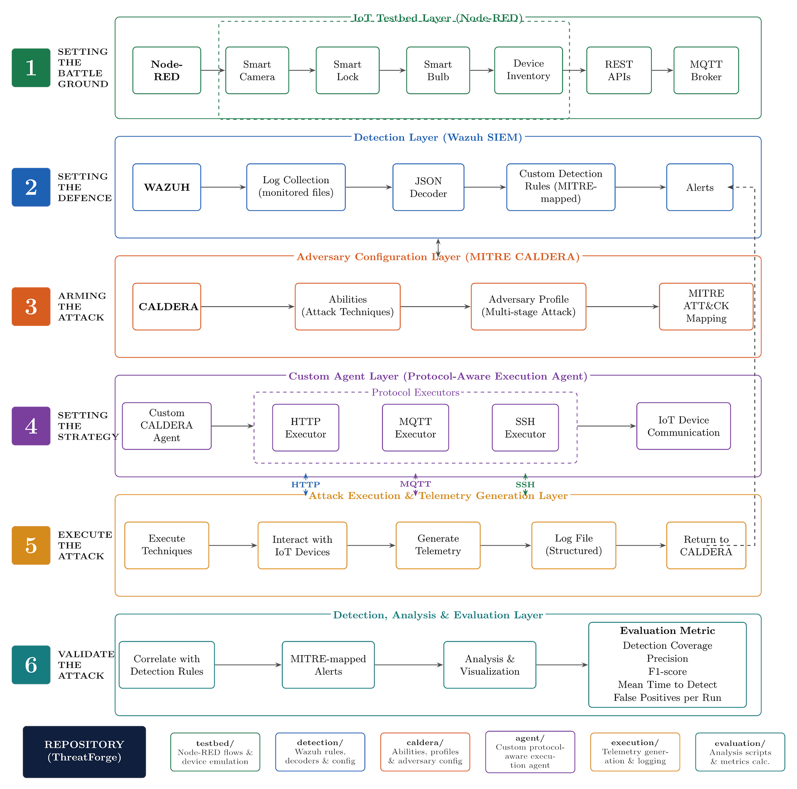
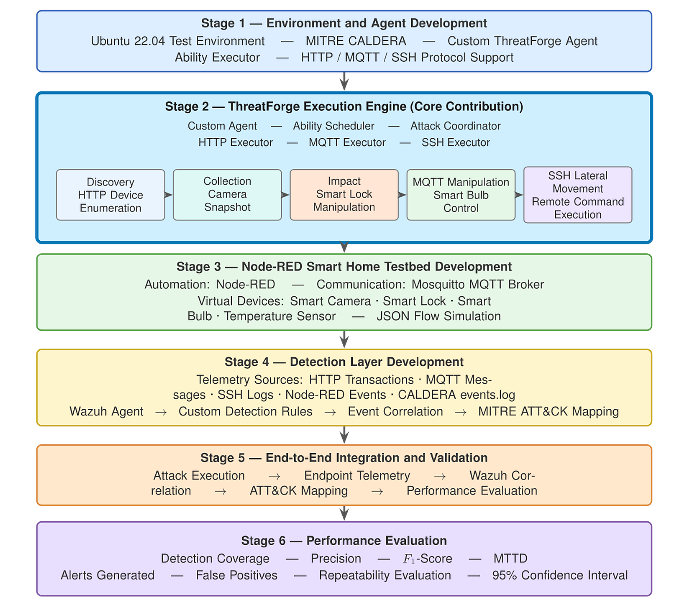
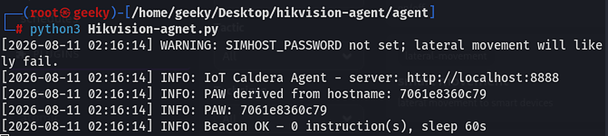
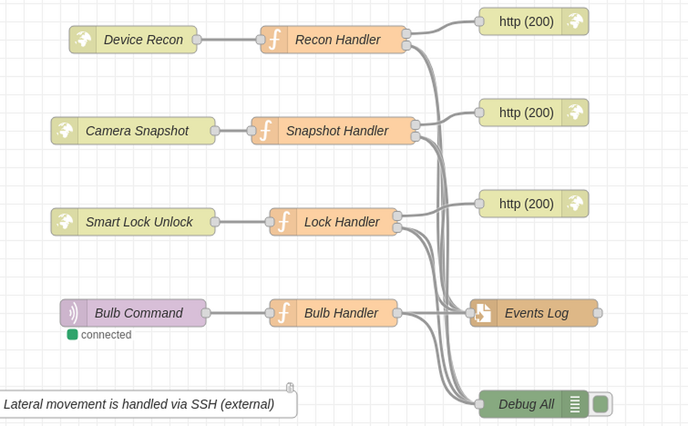
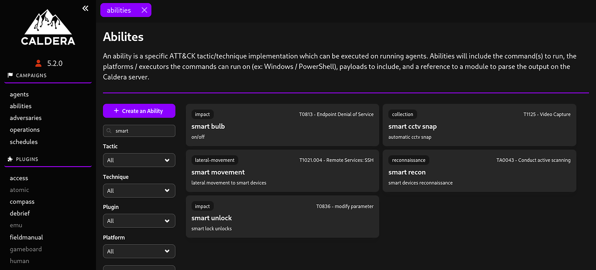
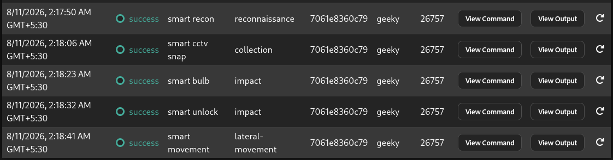
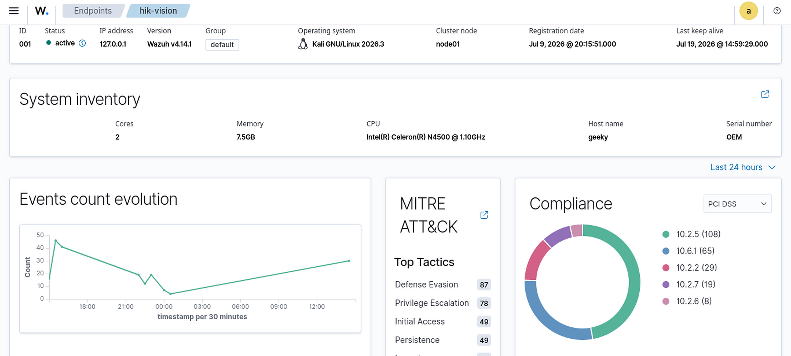
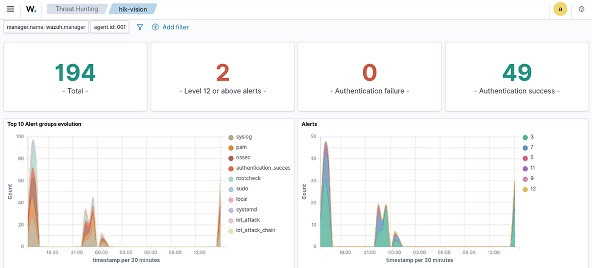
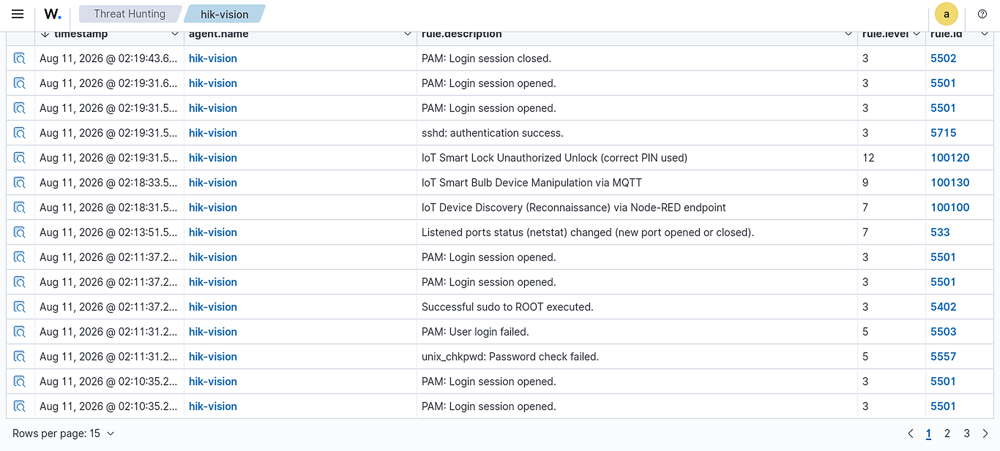
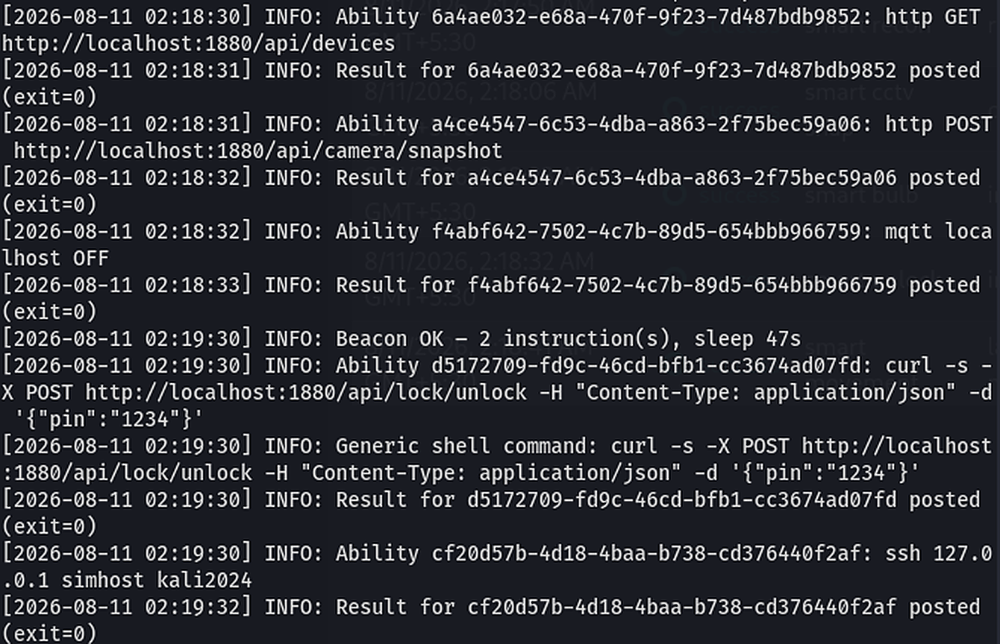

<div align="center">



# ThreatForge

**An IoT Adversary Emulation and Detection Validation Platform for Smart-Home Security**

Safely execute ATT&CK-aligned IoT attack chains, generate realistic device telemetry, and validate whether your security monitoring detects what matters — built on **MITRE CALDERA**, **Node-RED**, and **Wazuh**.

[](https://www.python.org/)
[](https://www.docker.com/)
[](https://caldera.mitre.org/)
[](https://wazuh.com/)
[](https://nodered.org/)
[](LICENSE)
[](#contributing)

[Overview](#overview) •
[Key Results](#key-results-at-a-glance) •
[Why ThreatForge](#why-threatforge) •
[Architecture](#architecture) •
[ThreatForge Agent](#threatforge-agent) •
[ATT&CK Coverage](#attck-technique-coverage) •
[Detection Engineering](#detection-engineering) •
[Quick Start](#quick-start) •
[Performance](#performance--validation) •
[Documentation](#documentation) •
[Roadmap](#roadmap)

</div>

---

## Overview

IoT devices increasingly sit inside the same environments that security teams already monitor: cameras, locks, bulbs, hubs, gateways, and companion hosts. Traditional adversary-emulation tooling is largely built around enterprise endpoints, while IoT security testing often remains device-specific, difficult to reproduce, and disconnected from the detection stack.

**ThreatForge** turns that gap into an actionable security workflow. It extends MITRE CALDERA with a protocol-aware IoT agent, connects it to a controlled Node-RED smart-home environment, and uses Wazuh to validate the resulting telemetry and detections. Security teams can execute a known attack path, observe what the environment actually records, and verify whether the monitoring pipeline catches it.

ThreatForge integrates:

- **MITRE CALDERA** — ATT&CK-aligned adversary emulation and operation orchestration
- **ThreatForge Agent** — a CALDERA-compatible agent with native HTTP, MQTT, and SSH executors
- **Node-RED** — controlled smart-home simulation for device discovery, camera, lock, and bulb interactions
- **Wazuh** — telemetry collection, MITRE-mapped detection rules, alerting, and validation
- **Docker** — reproducible deployment for an isolated security-testing environment

<p align="center">
  
</p>

ThreatForge is built for teams that need evidence, not assumptions: **execute the attack, verify the target-side activity, and confirm the alert**. This creates a direct execution-to-telemetry-to-detection workflow for IoT security validation.

Built for **red and purple teams, detection engineers, SOC analysts, IoT security programmes, and security researchers** that need a safe environment for measurable testing.

## Key Results at a Glance

| Metric | Benchmark result |
|---|---:|
| **Detection Coverage** | **94.4% ± 9.2%** |
| **Precision** | **89.8% ± 10.4%** |
| **F1-score** | **91.6% ± 7.5%** |
| **Mean Time to Detect (MTTD)** | **59.0 ± 7.0 s** |
| **False Positives per Run** | **0.60 ± 0.65** |

Across **25 repeated laboratory runs** of the five-technique `Custom IoT Adversary` profile, ThreatForge recorded **125 technique instances** and the performance shown above. Proven under controlled laboratory conditions. See the [full research paper](research/IOT-adversary-emulation-research-paper.pdf) for methodology, statistics, limitations, and detailed results.

## Why ThreatForge

| Security challenge | How ThreatForge addresses it |
|---|---|
| IoT attacks are difficult to emulate with conventional endpoint-focused tooling | Protocol-aware HTTP, MQTT, and SSH execution is built into the ThreatForge Agent |
| Attack execution and detection validation are often separate activities | ThreatForge connects execution, telemetry, and SIEM alerting in one closed-loop workflow |
| Detection effectiveness is difficult to demonstrate consistently | ATT&CK-mapped abilities can be executed repeatedly in the same controlled environment |
| Security teams need to know what their monitoring actually saw | Device/testbed telemetry and host-level logs provide target-side evidence alongside CALDERA execution records |
| Testing real consumer devices can create operational and safety constraints | Node-RED provides a controlled smart-home environment without requiring physical IoT hardware |

## Key Features

| Category | Capability |
|---|---|
| **Emulation** | IoT-focused adversary emulation through a custom MITRE CALDERA-compatible agent |
| **ATT&CK Alignment** | Five evaluated abilities mapped to MITRE ATT&CK and ATT&CK for ICS techniques |
| **Protocol Support** | Native HTTP, MQTT, and SSH execution |
| **Simulation** | Controlled Node-RED smart-home environment representing camera, lock, bulb, and device-discovery behaviour |
| **Detection** | Wazuh-based detection engineering with MITRE-mapped rules |
| **Closed-Loop Validation** | Correlates adversary execution, target-side telemetry, and SIEM alerts |
| **Reproducibility** | Docker-supported deployment and repeatable attack execution in an isolated environment |
| **Audience** | Purple teams, detection engineers, SOC analysts, IoT security teams, and researchers |

## Architecture

<p align="center">
  
</p>

**Flow:** CALDERA orchestrates the `Custom IoT Adversary` profile → the ThreatForge Agent dispatches protocol-specific actions over HTTP, MQTT, or SSH → the Node-RED testbed or companion host generates observable activity → Wazuh collects and evaluates the telemetry → execution, telemetry, and alert records are correlated for validation.

### Data Flow & Ports

| Hop | Protocol / Port | Description |
|---|---|---|
| CALDERA → ThreatForge Agent | HTTPS `8888` (CALDERA API) | Operation tasking, ability retrieval, and result reporting |
| Agent → IoT Testbed (HTTP) | HTTP `1880` (Node-RED) | Device state queries, snapshot retrieval, and REST-style device control |
| Agent → IoT Testbed (MQTT) | MQTT `1883` | Topic-based command delivery and telemetry generation |
| Agent → Companion Host (SSH) | SSH `22` | SSH-based lateral-movement activity captured through host-level logs |
| Testbed / Host → Wazuh | Log / telemetry pipeline | Collection of device and host activity for detection and correlation |
| Analyst → Wazuh Dashboard | HTTPS `443` | Alert review, detection tuning, and validation |

---

## ThreatForge Agent
The ThreatForge Agent connects CALDERA tasking to IoT communication protocols, dispatching actions through dedicated HTTP, MQTT, and SSH executors.

- **Beacon-based tasking** — follows CALDERA's communication model for receiving and reporting operations
- **Protocol-specific execution** — routes actions to dedicated HTTP, MQTT, or SSH executors
- **Externalised configuration** — runtime parameters are kept separate from execution logic
- **Runtime substitution** — ability definitions can reference environment-specific values without hard-coding them
- **Fault-tolerant execution** — failures are logged and handled without terminating the complete agent process


<p align="center">
  
</p>

<p align="center"><em>Five-stage `Custom IoT Adversary` profile executing in CALDERA across reconnaissance, collection, impact, and lateral movement.</em></p>

```
agent/
├── core/
│   ├── beacon.py          # CALDERA check-in and tasking loop
│   ├── executor_base.py   # Protocol executor interface
│   └── fact_resolver.py   # Resolves environment-specific targets/facts
├── executors/
│   ├── http_executor.py
│   ├── mqtt_executor.py
│   └── ssh_executor.py
└── config/
    └── agent.yml          # Agent identity, C2 endpoint, and runtime configuration
```

The Node-RED testbed provides observable discovery, camera, smart-lock, and smart-bulb behaviours. SSH lateral movement is handled separately through companion-host telemetry.

<p align="center">
  
</p>

<p align="center"><em>Node-RED smart-home testbed for device discovery, camera, smart-lock, and smart-bulb interactions; SSH activity is handled separately through the companion host.</em></p>

---

## ATT&CK Technique Coverage

ThreatForge maps each evaluated action to an ATT&CK technique so security teams can move from **attack behaviour → expected telemetry → detection rule** without losing the operational context.

| Tactic | Technique | ID | ThreatForge Implementation |
|---|---|---|---|
| Reconnaissance | Active Scanning | T1595 | Device/inventory discovery against the simulated smart-home environment |
| Collection | Video Capture | T1125 | Camera snapshot retrieval from the simulated device interface |
| Impact | Modify Parameter | T0836 | Smart-lock PIN interaction and lock-state manipulation |
| Impact | Manipulation of Control (ICS) | T0831 | MQTT-based smart-bulb ON/OFF manipulation |
| Lateral Movement | Remote Services: SSH | T1021.004 | SSH-based lateral movement against the companion host |

> The five abilities are composed into the `Custom IoT Adversary` profile and can be executed in a fixed order for repeatable validation.

<p align="center">
  
  <p align="center"><em>ThreatForge IoT abilities and the `Custom IoT Adversary` profile configured in CALDERA for repeatable execution.</em></p>

  &nbsp;&nbsp;

<p align="center">
  
<p align="center"><em>Five-stage `Custom IoT Adversary` profile executing in CALDERA across reconnaissance, collection, impact, and lateral movement.</em></p>

---

## Detection Engineering

ThreatForge makes detection validation a core security workflow. Wazuh receives the resulting telemetry and applies MITRE-mapped rules so teams can verify whether exercised behaviour is actually visible to their monitoring stack.

- **Structured telemetry** — Node-RED events are collected as JSON; SSH activity is observed through host logs
- **Native Wazuh decoding** — uses Wazuh's native JSON decoder
- **MITRE-mapped rules** — each rule corresponds to an expected outcome from the five-ability attack chain
- **Rule-to-ability traceability** — alerts can be tied back to the exercised ATT&CK technique and target-side event

| Ability | Rule ID | MITRE |
|---|---:|---|
| Device Discovery | 100100 | T1595 |
| Camera Snapshot | 100110 | T1125 |
| Smart Lock | 100120 | T0836 |
| Smart Bulb | 100130 | T0831 |
| Lateral Movement | 5715 / 5501 | T1021.004 |

The screenshot below shows the Wazuh alert stream associated with these rule identifiers, providing a direct operational view of the detection layer used by ThreatForge.

```
wazuh/
├── rules/           Detection rules and MITRE mappings
└── dashboards/      Wazuh dashboard exports and visual validation assets
```

<div align="center">


&nbsp;&nbsp;

&nbsp;&nbsp;


</div>

<div align="center">

<em>Wazuh endpoint summary showing system inventory and observed ATT&CK activity.</em>
&nbsp;&nbsp;&nbsp;
<em>Wazuh threat-hunting summary and alert timeline for a validation run.</em>
&nbsp;&nbsp;&nbsp;
<em>Wazuh alert events showing the detection rules for the evaluated IoT behaviours.</em>

</div>

---

## System Requirements

| Requirement | Minimum | Recommended |
|---|---|---|
| OS | Linux / macOS / Windows (WSL2) | Ubuntu 22.04 LTS |
| CPU | 4 cores | 8 cores |
| RAM | 8 GB | 16 GB |
| Disk | 20 GB free | 40 GB free (SSD) |
| Docker Engine | 24.x | Latest stable |
| Docker Compose | v2 | v2 |
| Python | 3.10 | 3.11+ |

---

## Repository Structure

```
ThreatForge/
├── research/       Research paper, figures, screenshots, and benchmark artefacts
├── docs/            Documentation (setup and usage)
├── agent/           ThreatForge Agent source
├── abilities/       MITRE CALDERA abilities
├── adversary/       Adversary profiles
├── testbed/         Node-RED smart-home IoT simulation
├── wazuh/           Detection rules and configuration
├── docker/          Docker deployment configuration
└── scripts/         Supporting utilities
```

---

## Technology Stack

| Component | Role |
|---|---|
| MITRE CALDERA | Adversary emulation and operation management |
| Python | ThreatForge Agent implementation |
| Node-RED | Smart-home device simulation |
| MQTT | IoT device communication protocol |
| HTTP | Device interaction and API layer |
| SSH | Remote command execution |
| Wazuh | Detection, monitoring, and alerting |
| Docker | Reproducible environment deployment |

---

## Supported Attack Scenarios

- Device discovery and enumeration
- Camera snapshot collection
- MQTT command injection
- Smart lock manipulation
- SSH-based remote execution
- Security event generation
- End-to-end detection validation

Additional scenarios can be added by creating new CALDERA abilities and adversary profiles — see [Contributing](#contributing).

---

## How ThreatForge Compares

ThreatForge complements established adversary-emulation platforms with protocol-aware IoT execution and integrated detection validation.

| Evaluation Criterion | Atomic Red Team | MITRE CALDERA | Prelude Operator | Infection Monkey | **ThreatForge** |
|---|---:|---:|---:|---:|---:|
| ATT&CK-based emulation | ✓ | ✓ | ✓ | ◐ | ✓ |
| Native IoT protocol support | ✗ | ✗ | ✗ | ✗ | ✓ |
| Integrated detection validation | ✗ | ✗ | ✗ | ✗ | ✓ |
| Quantitative performance metrics | ✗ | ✗ | ✗ | ✗ | ✓ |
| Reproducible, open-source release | ✓ | ✓ | ◐ | ✓ | ✓ |

**Legend:** ✓ Supported · ✗ Not supported · ◐ Partial support

ThreatForge does not replace established emulation platforms. It adds an IoT-focused workflow for protocol-aware execution, detection validation, and measurable security outcomes.

---

## Performance & Validation

ThreatForge has been exercised across **25 laboratory runs** of the `Custom IoT Adversary`, covering **125 technique instances** with three synchronised telemetry sources and a **240-second validation window** per run.

| Metric | Result |
|---|---:|
| **Detection Coverage** | **94.4% ± 9.2%** |
| **Precision** | **89.8% ± 10.4%** |
| **F1-score** | **91.6% ± 7.5%** |
| **Mean Time to Detect** | **59.0 ± 7.0 s** |
| **False Positives / Run** | **0.60 ± 0.65** |

These figures come from an **isolated Node-RED smart-home environment** and should be read as controlled performance evidence, not a guarantee of production performance across every IoT deployment. For methodology, statistical detail, confidence intervals, and limitations, see the [full research paper](research/IOT-adversary-emulation-research-paper.pdf).

<p align="center">
   
</p>

<p align="center"><em>Five-stage `Custom IoT Adversary` profile executing in CALDERA across reconnaissance, collection, impact, and lateral movement.</em></p>

<p align="center">
  
</p>

<p align="center"><em>Detection performance summary across 25 validation runs.</em></p>

---

## Quick Start

Bring up the isolated lab, complete the one-time configuration, then run `Custom IoT Adversary` from CALDERA.

**1. Clone**

```bash
git clone https://github.com/giridharan-veda/ThreatForge.git
cd ThreatForge
```

**2. Start the lab services**

```bash
docker compose -f docker/caldera/docker-compose.yml up -d
docker compose -f docker/wazuh/docker-compose.yml up -d
```

**3. Complete the one-time configuration**

Follow [`docs/setup-guide.md`](docs/setup-guide.md) to configure the Node-RED flow, ThreatForge Agent, and CALDERA/Wazuh integration.

**4. Run the attack chain**

Launch the `Custom IoT Adversary` profile in CALDERA. Review the resulting activity in Node-RED and Wazuh.

**Success looks like this:**

- CALDERA completes the five-ability operation
- target-side activity appears in Node-RED or the companion host logs
- Wazuh produces the corresponding MITRE-mapped detections

Use [`docs/usage-guide.md`](docs/usage-guide.md) for the validation workflow and result review. Run ThreatForge only in an isolated, authorised test environment.

---

## Documentation

Full documentation lives under [`docs/`](docs/):

| Document | Description |
|---|---|
| `setup-guide.md` | Installation and environment configuration |
| `usage-guide.md` | Running ThreatForge operations and validation workflows |
| `README.md` | Documentation index |

The [full research paper](research/IOT-adversary-emulation-research-paper.pdf) provides the technical detail, validation methodology, results, and limitations behind ThreatForge.

Additional figures, screenshots, and benchmark artefacts are available under [`research/`](research/).

---

## Project Objectives

- Enable safe adversary emulation for smart-home IoT environments
- Validate defensive visibility instead of relying on execution status alone
- Map IoT attack behaviour to MITRE ATT&CK and ATT&CK for ICS techniques
- Support repeatable purple-team and detection-engineering workflows
- Provide quantitative evidence for detection coverage and responsiveness
- Give researchers and security teams a controlled environment for IoT security testing

## Intended Audience

Purple teams · red teams · SOC analysts · detection engineers · IoT security teams · cybersecurity researchers · academic institutions · security students

---

## Roadmap

- [ ] Additional IoT device profiles and protocols
- [ ] BLE and Zigbee protocol support
- [ ] ICS/SCADA device simulation
- [ ] Adaptive or conditional adversary behaviour
- [ ] Physical and commercial IoT evaluation
- [ ] Alternative SIEM and independently authored detection-rule evaluation
- [ ] Firmware-level and physical-layer attack scenarios

---

## Contributing

Contributions are welcome and appreciated.

1. Fork the repository
2. Create a feature branch
3. Commit your changes
4. Open a Pull Request

For significant changes, please open an Issue first to discuss the proposed direction.

---

## Citation

If you use ThreatForge in security assessments, purple-team exercises, research, or publications, please cite this repository using the included [`CITATION.cff`](CITATION.cff). BibTeX and other citation formats are generated automatically by GitHub.

For the technical basis and validation results behind ThreatForge, see the [full research paper](research/IOT-adversary-emulation-research-paper.pdf).

---

## Disclaimer

ThreatForge is developed **solely for educational, research, and authorised security testing purposes**. It is intended to be deployed in isolated, controlled environments and not against systems or devices without explicit permission. The authors are not responsible for misuse of the software. Users are responsible for ensuring compliance with applicable laws, organisational policies, and ethical guidelines.

---

## License

Licensed under the [MIT License](LICENSE).

## Acknowledgements

ThreatForge builds on the work of outstanding open-source projects and communities, including MITRE CALDERA, Wazuh, Node-RED, Docker, and the broader Python community.

<div align="center">

**ThreatForge — Forging Adversaries. Strengthening Defenders.**

</div>
